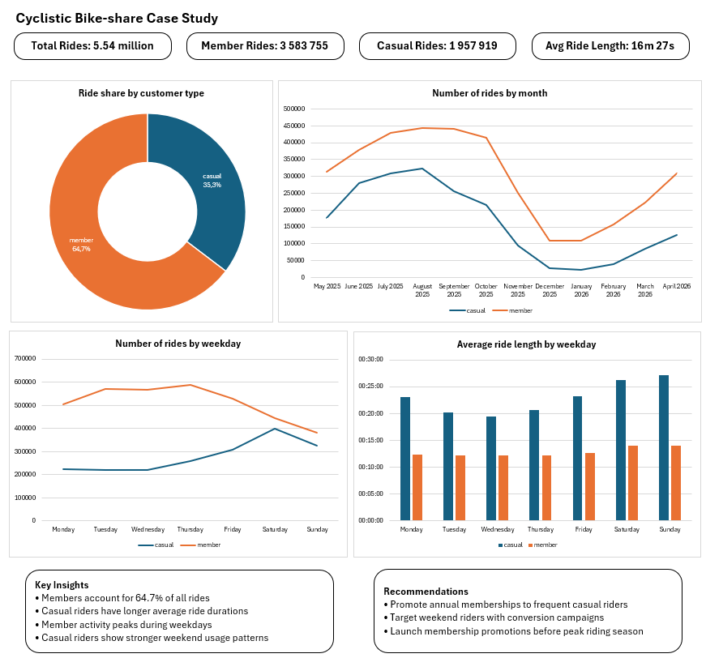

# Cyclistic Bike Share Analysis

## Project Overview

Analysis of 12 months of historical trip data in order to design a new marketing strategy to convert casual riders into annual members for Cyclistic, a bike-share company in Chicago.

## Business Task

How does the behavior of annual members differ from that of casual riders?

## Dataset

* 12 months of historical Cyclistic trip data
* May 2025 – April 2026
* 5.5 million rides after data cleaning

## Data Source

Historical trip data provided by Motivate International Inc. for the Cyclistic bike-share program.

## Tools Used

* Excel
* Power Query
* Excel Data Model
* Pivot Tables
* Pivot Charts

## Data Cleaning

* Excluded station and coordinate fields due to missing values
* Standardized datetime formats
* Removed duplicate records
* Created ride\_length variable
* Created day\_of\_week variable
* Removed 155 781 rides shorter than one minute
* Combined 12 monthly datasets

## Analysis

Three Pivot Tables were created to analyze:

* Average ride length by weekday and user type
* Number of rides by weekday and user type 
* Number of rides by month and user type

The analysis focused on identifying behavioral differences between casual riders and annual members.

## Key Findings

* Casual riders use the service less frequently but spend significantly more time per ride than annual members
* Annual members complete a significantly higher number of trips
* Ride duration for casual riders increases considerably during weekends
* Average ride duration for annual members remains relatively stable throughout the week
* Weather conditions strongly influence bike usage

The analysis suggests that the greatest opportunity for membership growth lies among casual riders who regularly use Cyclistic bikes for recreational and weekend trips.

## Business Impact

The analysis indicates that casual riders represent the most promising target segment for membership conversion campaigns due to their strong engagement during recreational and weekend trips.

## Dashboard

The final dashboard summarizes the main findings of the analysis through:

- KPI overview
- Ride share by customer type
- Monthly ride trends
- Weekly ride patterns
- Average ride duration analysis
- Key insights
- Business recommendations

## Recommendations

Based on the analysis, the following recommendations are proposed:

* Promote cost savings for frequent riders: develop marketing campaigns emphasizing the long-term financial benefits of annual membership compared to single rides.
* Offer seasonal membership discounts: introduce discounted seasonal membership plans targeted at casual riders during high-activity months.
* Launch weekend conversion campaigns: since casual rider activity peaks during weekends, targeted weekend promotions could encourage casual riders to become annual members.

## Conclusion

The analysis shows that casual riders exhibit longer ride durations and stronger weekend usage patterns, suggesting that recreational riders represent the most promising segment for membership conversion initiatives.

## Files

* Cyclistic\_Bike-share\_Report.pdf
* Cyclistic\_Bike-share\_Presentation.pdf

